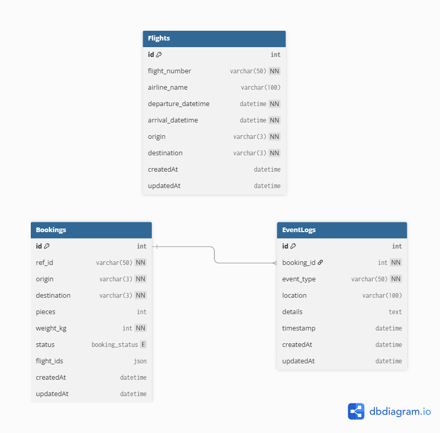
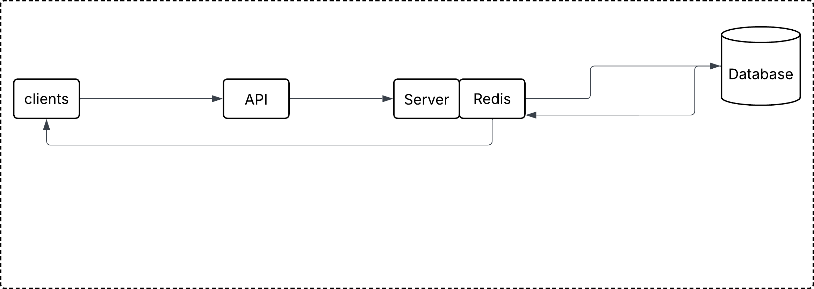

# 🛰️ Gocomet Project

A full-stack web application developed as part of the Gocomet assignment.  
The project consists of a **React-based frontend** and a **Node.js (Express) backend**, demonstrating clean architecture, REST API design, and scalable project structure.

---

## 📌 Features

- Full-stack architecture (Frontend + Backend)
- RESTful APIs
- Modular backend structure
- Easy local setup and execution
- Database Design and Low-Level Design documentation support
- Scalable and maintainable codebase

---

## 💻 Tech Stack

### Frontend
- React
- JavaScript
- HTML / CSS
- npm

### Backend
- Node.js
- Express.js
- REST APIs

### Database
- (Add database used – MongoDB / MySQL / PostgreSQL)

---

## 🚀 Getting Started

Follow the steps below to run the project locally on your machine.

---

## 🛠️ Prerequisites

Ensure the following are installed:

```bash
node -v
npm -v

## Clone the project

Clone the repository and change into the project folder:

```
git clone https://github.com/lokeshgarg16/gocomet-project.git
cd gocomet-project
```

### Frontend Setup & Run

Navigate to the frontend directory, install dependencies, and start the app:

```bash
cd frontend
npm install
npm run start
```

The frontend will start on http://localhost:3000 (or the configured port).

### Backend Setup & Run

Navigate to the backend directory, install dependencies, and start the server:

```bash
cd cargo-backend
npm install
node server.js
```

The backend will start on the configured port (for example, http://localhost:5000).

### Application Flow

- User interacts with the frontend UI
- Frontend sends HTTP requests to backend APIs
- Backend processes requests and interacts with the database
- Backend sends responses back to the frontend
- Frontend renders data to the user

### Database Design

The following diagram represents the database schema used in the project.



### Low-Level Design (LLD)

The Low-Level Design illustrates internal components, request flow, and module interactions.



### Project Structure
```
gocomet-project/
│
├── frontend/               # React Frontend
│
├── cargo-backend/          # Node.js Backend
│   ├── server.js           # Entry point
│   ├── routes/             # API routes
│   ├── controllers/        # Business logic
│   ├── models/             # DB models
│   └── package.json
│
└── README.md
```

## Postaman APIs
``` https://lokeshagarwal-8237469.postman.co/workspace/Gocomet-Project-APIs~16bec444-b3e4-4de0-8267-acb78f349774/collection/43673831-a45103ee-f866-48f6-bf5c-0f810d62ce64?action=share&creator=43673831 ```

---
